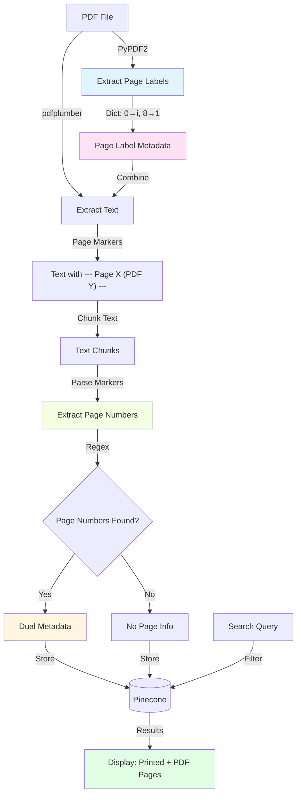
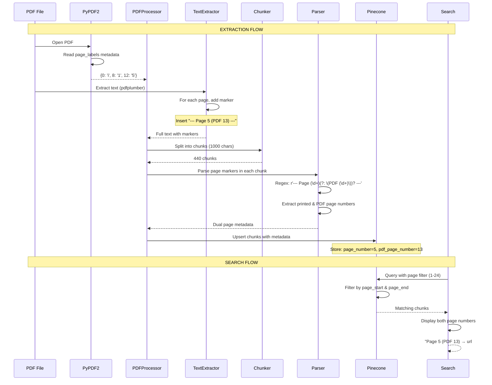

# Code Tour: PDF Pagination Extraction System

**Welcome!** This tour will guide you through the dual page numbering system that enables both academic citations (using printed page numbers) and direct PDF links (using PDF page numbers). By the end, you'll understand how we extract, store, and use both types of page numbers for semantic search.

## Table of Contents

1. [Overview & Motivation](#overview--motivation)
2. [Key Concepts](#key-concepts)
3. [Architecture](#architecture)
4. [Core Components](#core-components)
5. [Workflow Walkthrough](#workflow-walkthrough)
6. [Code Deep Dive](#code-deep-dive)
7. [Common Operations](#common-operations)
8. [Troubleshooting](#troubleshooting)
9. [External Resources](#external-resources)

---

## Overview & Motivation

### What Problem Does This Solve?

When working with academic PDFs, we face a common challenge: **the page numbers you see in the document (printed pages) don't match the actual PDF file page numbers**.

**Example from our textbooks:**
- **Printed page 5** in "Lehrbuch der Politikfeldanalyse" (what you cite in your essay)
- **PDF page 13** in the actual file (what you need to link to: `url#page=13`)

This happens because PDFs often have:
- Front matter with roman numerals: i, ii, iii, iv, v, vi, vii, viii
- Main content starting at "page 1": 1, 2, 3, 4, 5...
- But these are actually PDF pages: 9, 10, 11, 12, 13...

### Why We Need Both Page Numbers

**For Academic Work:**
- ✅ **Citations**: Use printed page numbers → `(Schubert & Bandelow, 2014, S. 5)`
- ✅ **Direct Links**: Use PDF page numbers → `https://storage.com/file.pdf#page=13`
- ✅ **Search Results**: Show both for maximum usefulness

### What Does This System Do?

1. **Extracts PDF metadata page labels** (i, ii, iii, 1, 2, 3) if available
2. **Generates dual page markers** in extracted text: `--- Page 5 (PDF 13) ---`
3. **Parses both page numbers** when chunking text
4. **Stores dual metadata** in Pinecone for filtering and display
5. **Enables page-based search** with both printed and PDF page numbers

### Real-World Example

When searching for "Policy definition" in pages 1-24:

**What you search for:**
```bash
# Filter by printed pages (for academic citation)
search_pdfs.py "Policy definition" --filter-pages 1-24
```

**What you get back:**
```
📄 Printed Page: 5 (for citation: "Schubert & Bandelow, 2014, S. 5")
🔗 PDF Page: 13 (for direct link: url#page=13)
🌐 Direct Link: https://firebasestorage.googleapis.com/.../file.pdf#page=13
```

---

## Key Concepts

### 1. PDF Page Labels

**What are they?**

PDF files can contain **page label metadata** in their catalog that defines what each physical page should be called. This is separate from the actual page index.

**Example Structure:**
```
PDF Page Index  →  Page Label
0               →  i      (Cover)
1               →  ii     (Title page)
2               →  iii    (Copyright)
...
7               →  viii   (Table of contents)
8               →  1      (Chapter 1 starts)
9               →  2
10              →  3
...
12              →  5      (Our "printed page 5")
```

**PDF Specification:**

From [PDF 32000-1:2008 Section 8.3.1](https://opensource.adobe.com/dc-acrobat-sdk-docs/pdfstandards/PDF32000_2008.pdf):

> "Each page in a PDF document shall be identified by an integer page index that expresses the page's relative position within the document. In addition, a document may optionally define page labels (PDF 1.3) to identify each page visually on the screen or in print."

**How We Extract Them:**

PyPDF2 provides access via the `page_labels` property:

```python
from pypdf import PdfReader

reader = PdfReader(pdf_file)
page_labels = reader.page_labels  # Dict: {0: 'i', 1: 'ii', ..., 12: '5'}
```

**Reference:**
- [PyPDF2 Documentation](https://pypdf2.readthedocs.io/en/latest/)
- [page_labels property](https://pypdf2.readthedocs.io/en/latest/user/metadata.html)

---

### 2. Dual Page Numbering System

**The Challenge:**

We need to maintain TWO types of page numbers throughout the entire system:

| Type | Used For | Example | Storage |
|------|----------|---------|---------|
| **Printed Page** | Academic citations, human reference | "Page 5" | `page_number: 5` |
| **PDF Page** | Direct PDF links, machine navigation | "PDF page 13" | `pdf_page_number: 13` |

**Why Both?**

1. **For students**: "Find the definition on page 5" (printed)
2. **For system**: "Jump to page 13" (PDF file)
3. **For search**: "Show me pages 1-24" (printed range, not PDF pages 9-32)

**Key Insight:**

The relationship is **document-specific**:
- In book A: Printed page 5 = PDF page 13 (8-page offset)
- In book B: Printed page 5 = PDF page 5 (no offset, no front matter)

---

### 3. Page Markers in Extracted Text

**Format:**

When we extract text from PDFs, we insert page markers:

```
--- Page {printed_page} (PDF {pdf_page}) ---
```

**Example:**
```text
--- Page 5 (PDF 13) ---
Politikfeldanalyse: Dimensionen und Fragestellungen

Die Kategorie Policy umfasst die inhaltlichen Aspekte von Politik...

--- Page 6 (PDF 14) ---
Der Begriff Polity bezeichnet die strukturellen Aspekte...
```

**Fallback Formats:**

When metadata isn't available, we use fallbacks:

```text
--- Page 5 (PDF 5) ---      # No front matter, pages align
--- Page 13 ---             # Old format (PDF page only)
```

---

### 4. Metadata Structure

**Complete Page Metadata:**

Each chunk stores comprehensive page information:

```python
{
    # Printed page metadata (for citations)
    'page_number': 5,           # Primary printed page
    'page_start': 5,            # First printed page in chunk
    'page_end': 6,              # Last printed page in chunk
    'page_range': '5-6',        # Human-readable range

    # PDF page metadata (for linking)
    'pdf_page_number': 13,      # Primary PDF page
    'pdf_page_start': 13,       # First PDF page in chunk
    'pdf_page_end': 14,         # Last PDF page in chunk
    'pdf_page_range': '13-14',  # Human-readable range

    # Other metadata
    'document_id': 'lehrbuch-politikfeldanalyse',
    'document_title': 'Lehrbuch der Politikfeldanalyse',
    'chunk_number': 42,
    'chunk_text': '...'
}
```

**Why Ranges?**

Chunks can span multiple pages due to our 1000-character chunk size with 200-character overlap.

---

## Architecture

### System Diagram



### Data Flow: From PDF to Search Results



### Directory Structure

```
pdf-search/
├── pdf_processor.py              # Core pagination logic
│   ├── _extract_page_labels()    # Line ~80: Extract from PDF metadata
│   ├── extract_text_pypdf2()     # Line ~95: Insert page markers
│   ├── extract_text_pdfplumber() # Line ~135: Insert page markers
│   └── _extract_page_numbers()   # Line ~850: Parse markers with regex
│
├── pinecone_manager.py           # Stores metadata in Pinecone
│   └── upsert_chunks()           # Line ~118: Index with page metadata
│
├── search_ubung_a.py             # Example: Search with page filtering
│   └── search_term_in_document() # Line ~13: Filter by page range
│
└── code-tours/
    └── PAGINATION-EXTRACTION.md  # This file!
```

---

## Core Components

### 1. Page Label Extraction

**File**: [`pdf_processor.py`](../pdf_processor.py)

**Function**: `_extract_page_labels(reader)` - [`pdf_processor.py:80`](../pdf_processor.py#L80)

**Purpose**: Extract page label metadata from PDF catalog using PyPDF2.

**Implementation:**

```python
def _extract_page_labels(self, reader) -> Dict[int, str]:
    """
    Extract page labels from PDF metadata.

    PDF files can define custom page labels (like 'i', 'ii', 'iii', '1', '2')
    that differ from the physical page index (0, 1, 2, 3...).

    Args:
        reader: PyPDF2 PdfReader instance

    Returns:
        Dict mapping page index to label: {0: 'i', 1: 'ii', 8: '1', 12: '5'}
    """
    try:
        if hasattr(reader, 'page_labels') and reader.page_labels:
            return reader.page_labels
    except Exception as e:
        print(f"Warning: Could not extract page labels: {e}")

    return {}  # No labels available
```

**What It Returns:**

```python
{
    0: 'i',      # Cover page
    1: 'ii',     # Title page
    2: 'iii',    # Copyright
    # ...
    7: 'viii',   # Table of contents
    8: '1',      # Chapter 1 starts (PDF page 9, printed page 1)
    9: '2',
    10: '3',
    11: '4',
    12: '5',     # The "page 5" we cite
    # ...
}
```

**Failure Cases:**
- PDF has no page label metadata → returns `{}`
- Old PDF version (< 1.3) → returns `{}`
- Corrupted metadata → catches exception, returns `{}`

**Fallback Strategy:**
When page labels aren't available, we use the page index + 1 as the page number.

---

### 2. Text Extraction with Page Markers

**File**: [`pdf_processor.py`](../pdf_processor.py)

#### Method A: PyPDF2 Extraction

**Function**: `extract_text_pypdf2(pdf_content)` - [`pdf_processor.py:95`](../pdf_processor.py#L95)

**Key Section** ([`pdf_processor.py:102-122`](../pdf_processor.py#L102-L122)):

```python
def extract_text_pypdf2(self, pdf_content: bytes) -> str:
    """Extract text from PDF using PyPDF2 with printed page numbers."""

    with io.BytesIO(pdf_content) as pdf_file:
        reader = PdfReader(pdf_file)

        # Step 1: Extract page labels from PDF metadata
        page_labels = self._extract_page_labels(reader)

        text = []

        # Step 2: Extract text from each page
        for page_num, page in enumerate(reader.pages):
            try:
                page_text = page.extract_text()
                if page_text:
                    # Calculate both page numbers
                    pdf_page = page_num + 1  # 1-based PDF page (9, 10, 11...)

                    # Priority 1: Use page label from PDF metadata
                    if page_num in page_labels:
                        printed_page = page_labels[page_num]  # e.g., '5'
                        text.append(f"--- Page {printed_page} (PDF {pdf_page}) ---\n{page_text}")

                    # Priority 2: Try to extract from header/footer
                    elif printed_page := self._extract_printed_page_number(page_text):
                        text.append(f"--- Page {printed_page} (PDF {pdf_page}) ---\n{page_text}")

                    # Priority 3: Fallback to PDF page number
                    else:
                        text.append(f"--- Page {pdf_page} (PDF {pdf_page}) ---\n{page_text}")

            except Exception as e:
                print(f"Warning: Could not extract text from page {page_num}: {e}")
                continue

        return '\n\n'.join(text)
```

**Extraction Priority:**

1. **PDF Metadata** (most reliable) → `--- Page 5 (PDF 13) ---`
2. **Header/Footer Heuristics** (if metadata missing) → searches for "page 5", "Seite 5", etc.
3. **PDF Page Number** (fallback) → `--- Page 13 (PDF 13) ---`

**Example Output:**

```text
--- Page i (PDF 1) ---
[Cover page text...]

--- Page ii (PDF 2) ---
[Title page text...]

--- Page 1 (PDF 9) ---
Kapitel 1: Einleitung
[Chapter 1 content...]

--- Page 5 (PDF 13) ---
Politikfeldanalyse: Dimensionen und Fragestellungen
Die Kategorie Policy umfasst die inhaltlichen Aspekte...
```

#### Method B: pdfplumber Extraction

**Function**: `extract_text_pdfplumber(pdf_content)` - [`pdf_processor.py:135`](../pdf_processor.py#L135)

Same logic as PyPDF2, but uses pdfplumber for better text extraction quality:

```python
def extract_text_pdfplumber(self, pdf_content: bytes) -> str:
    """Extract text from PDF using pdfplumber with printed page numbers."""

    with io.BytesIO(pdf_content) as pdf_file:
        # First, get page labels using PyPDF2
        reader = PdfReader(pdf_file)
        page_labels = self._extract_page_labels(reader)

        # Then extract text using pdfplumber
        pdf_file.seek(0)  # Reset file pointer
        with pdfplumber.open(pdf_file) as pdf:
            text = []
            for page_num, page in enumerate(pdf.pages):
                page_text = page.extract_text()
                if page_text:
                    pdf_page = page_num + 1

                    # Same priority logic as PyPDF2
                    if page_num in page_labels:
                        printed_page = page_labels[page_num]
                        text.append(f"--- Page {printed_page} (PDF {pdf_page}) ---\n{page_text}")
                    # ... (same fallback logic)

            return '\n\n'.join(text)
```

**Why Two Methods?**

- **pdfplumber**: Better text extraction (preferred)
- **PyPDF2**: Fallback if pdfplumber fails
- **Both** support page labels via PyPDF2's `page_labels` property

---

### 3. Page Number Parsing

**File**: [`pdf_processor.py`](../pdf_processor.py)

**Function**: `_extract_page_numbers(text)` - [`pdf_processor.py:850`](../pdf_processor.py#L850)

**Purpose**: Parse page markers in chunk text to extract both printed and PDF page numbers.

**Full Implementation:**

```python
def _extract_page_numbers(self, text: str) -> Dict[str, Any]:
    """
    Extract page numbers from chunk text containing page markers.

    Parses markers like:
        "--- Page 5 (PDF 13) ---"  # Dual page numbers
        "--- Page 5 ---"           # Printed page only (old format)

    Args:
        text: Chunk text potentially containing page markers

    Returns:
        Dict with dual page metadata:
        {
            # Printed page metadata (for citations)
            'page_number': 5,           # Primary printed page
            'page_start': 5,            # First printed page in chunk
            'page_end': 6,              # Last printed page in chunk
            'page_range': '5-6',        # Human-readable range

            # PDF page metadata (for linking)
            'pdf_page_number': 13,      # Primary PDF page
            'pdf_page_start': 13,       # First PDF page in chunk
            'pdf_page_end': 14,         # Last PDF page in chunk
            'pdf_page_range': '13-14'   # Human-readable range
        }
    """

    # Regex pattern to match both formats
    # Group 1: Printed page (required)
    # Group 2: PDF page (optional)
    page_pattern = r'--- Page (\d+)(?: \(PDF (\d+)\))? ---'
    matches = re.findall(page_pattern, text)

    if not matches:
        return {}  # No page markers found

    # Extract all page numbers from matches
    printed_pages = []
    pdf_pages = []

    for match in matches:
        # match[0] = printed page (always present)
        # match[1] = PDF page (may be empty string if not present)

        printed_page = int(match[0])
        printed_pages.append(printed_page)

        if match[1]:  # PDF page number is present
            pdf_page = int(match[1])
            pdf_pages.append(pdf_page)

    # Calculate printed page metadata
    printed_start = min(printed_pages)
    printed_end = max(printed_pages)
    printed_primary = printed_pages[0]  # First page in chunk

    result = {
        'page_number': printed_primary,
        'page_start': printed_start,
        'page_end': printed_end,
        'page_range': str(printed_start) if printed_start == printed_end else f"{printed_start}-{printed_end}"
    }

    # Calculate PDF page metadata (if available)
    if pdf_pages:
        pdf_start = min(pdf_pages)
        pdf_end = max(pdf_pages)
        pdf_primary = pdf_pages[0]

        result.update({
            'pdf_page_number': pdf_primary,
            'pdf_page_start': pdf_start,
            'pdf_page_end': pdf_end,
            'pdf_page_range': str(pdf_start) if pdf_start == pdf_end else f"{pdf_start}-{pdf_end}"
        })

    return result
```

**Regex Pattern Breakdown:**

```regex
r'--- Page (\d+)(?: \(PDF (\d+)\))? ---'
          ^^^^^ ^^^^^^^^^^^^^^^^^^^^^^^^
          |     |
          |     Optional PDF page group
          |
          Required printed page group
```

**Components:**
- `--- Page ` - Literal text
- `(\d+)` - **Group 1**: Printed page number (required)
- `(?: ... )?` - Non-capturing optional group
- ` \(PDF ` - Literal text " (PDF "
- `(\d+)` - **Group 2**: PDF page number (optional)
- `\)` - Literal ")"
- ` ---` - Literal text " ---"

**Match Examples:**

```python
# Example 1: Dual page numbers
text = "--- Page 5 (PDF 13) ---\nSome content..."
matches = re.findall(pattern, text)
# matches = [('5', '13')]
#             ^^^  ^^^^
#             |    PDF page
#             Printed page

# Example 2: Single page (old format)
text = "--- Page 13 ---\nSome content..."
matches = re.findall(pattern, text)
# matches = [('13', '')]
#             ^^^  ^^
#             |    Empty (no PDF page)
#             Printed page

# Example 3: Chunk spanning two pages
text = """
--- Page 5 (PDF 13) ---
First part of text...

--- Page 6 (PDF 14) ---
Second part of text...
"""
matches = re.findall(pattern, text)
# matches = [('5', '13'), ('6', '14')]
```

**Result Examples:**

```python
# Single page chunk
{
    'page_number': 5,
    'page_start': 5,
    'page_end': 5,
    'page_range': '5',
    'pdf_page_number': 13,
    'pdf_page_start': 13,
    'pdf_page_end': 13,
    'pdf_page_range': '13'
}

# Multi-page chunk
{
    'page_number': 5,           # Primary (first page)
    'page_start': 5,
    'page_end': 6,
    'page_range': '5-6',
    'pdf_page_number': 13,      # Primary (first PDF page)
    'pdf_page_start': 13,
    'pdf_page_end': 14,
    'pdf_page_range': '13-14'
}
```

---

### 4. Metadata Integration

**File**: [`pdf_processor.py`](../pdf_processor.py)

**Function**: `chunk_text(text, document_id, metadata)` - [`pdf_processor.py:180`](../pdf_processor.py#L180)

**Key Section** ([`pdf_processor.py:210-235`](../pdf_processor.py#L210-L235)):

```python
def chunk_text(self, text: str, document_id: str, metadata: dict) -> List[Dict[str, Any]]:
    """
    Split text into chunks and extract page numbers.

    For each chunk:
    1. Split text using RecursiveCharacterTextSplitter
    2. Parse page markers to extract page numbers
    3. Combine with document metadata
    4. Return structured chunk objects
    """

    # Split text into chunks
    text_splitter = RecursiveCharacterTextSplitter(
        chunk_size=Config.CHUNK_SIZE,        # 1000 characters
        chunk_overlap=Config.CHUNK_OVERLAP,  # 200 characters
        separators=["\n\n", "\n", ". ", " ", ""]
    )
    chunks = text_splitter.split_text(text)

    structured_chunks = []

    for i, chunk_text in enumerate(chunks):
        # Parse page numbers from this chunk
        page_info = self._extract_page_numbers(chunk_text)

        # Build chunk metadata
        chunk_metadata = {
            'document_id': document_id,
            'document_title': metadata.get('title', ''),
            'chunk_number': i + 1,
            'total_chunks': len(chunks),
            'chunk_text': chunk_text[:500],  # Preview

            # Document-level metadata
            'learning_unit': metadata.get('learning_unit'),
            'course': metadata.get('course'),
            'material_type': metadata.get('type'),

            # Page information (both printed and PDF)
            **page_info  # Merge in: page_number, pdf_page_number, etc.
        }

        structured_chunks.append({
            'id': f"{document_id}#chunk_{i + 1}",
            'text': chunk_text,
            'metadata': chunk_metadata
        })

    return structured_chunks
```

**Result Structure:**

```python
[
    {
        'id': 'lehrbuch-politikfeldanalyse#chunk_42',
        'text': '--- Page 5 (PDF 13) ---\nPolitikfeldanalyse: Dimensionen...',
        'metadata': {
            # Document info
            'document_id': 'lehrbuch-politikfeldanalyse',
            'document_title': 'Lehrbuch der Politikfeldanalyse',
            'chunk_number': 42,
            'total_chunks': 1000,

            # Printed page info (for citations)
            'page_number': 5,
            'page_start': 5,
            'page_end': 5,
            'page_range': '5',

            # PDF page info (for links)
            'pdf_page_number': 13,
            'pdf_page_start': 13,
            'pdf_page_end': 13,
            'pdf_page_range': '13',

            # Other metadata
            'learning_unit': 'Übung_A',
            'material_type': 'textbook',
            'chunk_text': 'Politikfeldanalyse: Dimensionen...'
        }
    },
    # ... more chunks
]
```

---

## Workflow Walkthrough

### Complete Extraction Flow

Let's trace what happens when you index "Lehrbuch der Politikfeldanalyse":

```bash
python scripts/index_pdfs.py lehrbuch-politikfeldanalyse --reindex
```

#### Step 1: Download PDF

**Console Output:**
```
Downloading PDF from Firebase Storage...
```

Binary PDF content is downloaded from cloud storage.

#### Step 2: Extract Page Labels

**Code**: [`pdf_processor.py:102`](../pdf_processor.py#L102)

```python
reader = PdfReader(pdf_file)
page_labels = self._extract_page_labels(reader)
```

**Result:**
```python
page_labels = {
    0: 'I',      # Cover (roman numeral uppercase)
    1: 'II',
    2: 'III',
    3: 'IV',
    4: 'V',
    5: 'VI',
    6: 'VII',
    7: 'VIII',   # Table of contents
    8: '1',      # Chapter starts
    9: '2',
    10: '3',
    11: '4',
    12: '5',     # The famous "page 5"
    # ...
}
```

**Console Output:**
```
Extracting text using pdfplumber...
Using printed page numbers from PDF metadata
```

#### Step 3: Extract Text with Markers

**Code**: [`pdf_processor.py:105-122`](../pdf_processor.py#L105-L122)

For each PDF page (0-indexed):

```python
for page_num, page in enumerate(reader.pages):
    pdf_page = page_num + 1  # Convert to 1-based: 1, 2, 3...

    if page_num in page_labels:
        printed_page = page_labels[page_num]  # 'I', 'II', '1', '2', '5'...
        marker = f"--- Page {printed_page} (PDF {pdf_page}) ---"
    else:
        marker = f"--- Page {pdf_page} (PDF {pdf_page}) ---"

    text.append(f"{marker}\n{page_text}")
```

**Example Pages:**

**PDF Page 1** (index 0):
```text
--- Page I (PDF 1) ---
LEHRBUCH DER
POLITIKFELDANALYSE
Klaus Schubert, Nils C. Bandelow (Hrsg.)
```

**PDF Page 9** (index 8):
```text
--- Page 1 (PDF 9) ---
Politikfeldanalyse:
Dimensionen und Fragestellungen

Klaus Schubert und Nils C. Bandelow

1 Einleitung
...
```

**PDF Page 13** (index 12):
```text
--- Page 5 (PDF 13) ---
Politikfeldanalyse: Dimensionen und Fragestellungen | 5

Polity bezeichnet die formalen (verfassungsmäßigen oder normativen)
Aspekte von Politik. Sie bezeichnet konkrete (tatsächliche oder gewünschte)
politische Ordnungen...
```

**Console Output:**
```
Extracted 1477088 characters
Page number range: I to 282
```

#### Step 4: Chunk Text

**Code**: [`pdf_processor.py:180-195`](../pdf_processor.py#L180-L195)

```python
text_splitter = RecursiveCharacterTextSplitter(
    chunk_size=1000,
    chunk_overlap=200
)
chunks = text_splitter.split_text(text)
```

**Example Chunk** (chunk #42, contains page 5):
```text
--- Page 5 (PDF 13) ---
Politikfeldanalyse: Dimensionen und Fragestellungen | 5

sungsmäßigen oder normativen) Aspekte von Politik. Sie bezeichnet konkrete
(tatsächliche oder gewünschte) politische Ordnungen. Hier sind also einerseits
die politischen Ideen und Ideologien angesprochen, andererseits werden unter
Polity aber auch die aus diesen Ideen hervorgegangenen, formalen,
institutionellen Ordnungen politischer Systeme subsumiert. Letztere werden
in der Regel durchaus auch als geografisch g
```

**Console Output:**
```
Chunking text...
Warning: Document has 1952 chunks, limiting to 1000
Created 1000 chunks
```

#### Step 5: Parse Page Numbers

**Code**: [`pdf_processor.py:850-890`](../pdf_processor.py#L850-L890)

For chunk #42:

```python
chunk_text = "--- Page 5 (PDF 13) ---\nPolitikfeldanalyse..."

# Apply regex
pattern = r'--- Page (\d+)(?: \(PDF (\d+)\))? ---'
matches = re.findall(pattern, chunk_text)
# matches = [('5', '13')]

# Extract page numbers
printed_pages = [5]
pdf_pages = [13]

# Build metadata
page_info = {
    'page_number': 5,
    'page_start': 5,
    'page_end': 5,
    'page_range': '5',
    'pdf_page_number': 13,
    'pdf_page_start': 13,
    'pdf_page_end': 13,
    'pdf_page_range': '13'
}
```

**Why Roman Numerals Show "N/A":**

Our regex only captures decimal digits `\d+`:

```python
pattern = r'--- Page (\d+)(?: \(PDF (\d+)\))? ---'
                   ^^^^              ^^^^
                   Only matches: 0-9
```

So:
- `--- Page 5 (PDF 13) ---` ✅ Matches → `('5', '13')`
- `--- Page I (PDF 1) ---` ❌ Doesn't match → No page info

**Why This Is OK:**

Roman numeral pages (I, II, III) are typically:
- Front matter (cover, copyright, table of contents)
- Not the main content
- Not what students search for or cite

The actual content pages (1, 2, 3, ..., 282) all have decimal page numbers and match perfectly.

#### Step 6: Store in Pinecone

**Code**: [`pinecone_manager.py:150-162`](../pinecone_manager.py#L150-L162)

```python
vectors = []
for chunk, embedding in zip(chunks, embeddings):
    vectors.append({
        'id': chunk['id'],
        'values': embedding,  # 768-dim vector
        'metadata': chunk['metadata']  # Includes all page info!
    })

index.upsert(vectors=vectors, namespace='default')
```

**What Gets Stored:**

```python
{
    'id': 'lehrbuch-politikfeldanalyse#chunk_42',
    'values': [0.234, -0.156, 0.423, ..., 0.198],  # 768 numbers
    'metadata': {
        'document_id': 'lehrbuch-politikfeldanalyse',
        'document_title': 'Lehrbuch der Politikfeldanalyse',
        'chunk_number': 42,
        'page_number': 5,        # ← Printed page
        'pdf_page_number': 13,   # ← PDF page
        'page_range': '5',
        'pdf_page_range': '13',
        'chunk_text': 'Politikfeldanalyse: Dimensionen...'
    }
}
```

**Console Output:**
```
Generating embeddings...
Batches: 100%|██████████| 32/32 [01:17<00:00]

Upserting chunks: 100%|██████████| 10/10 [00:23<00:00]

✓ Upserted 1000 chunks
```

---

### Complete Search Flow

Let's trace what happens when searching for "Policy definition" in pages 1-24:

```python
# From search_ubung_a.py
results = search_term_in_document(
    manager=manager,
    term="Policy",
    document_id="lehrbuch-politikfeldanalyse",
    page_start=1,
    page_end=24,
    top_k=5
)
```

#### Step 1: Search Pinecone

**Code**: [`search_ubung_a.py:28-31`](../search_ubung_a.py#L28-L31)

```python
results = manager.search(
    query="Policy Definition Begriffsbestimmung",
    top_k=50,  # Get many results initially
    filter_metadata={'document_id': document_id}
)
```

**Pinecone Query:**
```python
index.query(
    vector=[0.21, -0.43, ...],  # Query embedding
    top_k=50,
    filter={'document_id': 'lehrbuch-politikfeldanalyse'},
    include_metadata=True
)
```

**Raw Results** (50 chunks from the document):
```python
[
    {'id': 'doc#chunk_42', 'score': 0.554, 'metadata': {'page_number': 5, ...}},
    {'id': 'doc#chunk_770', 'score': 0.541, 'metadata': {'page_number': 23, ...}},
    {'id': 'doc#chunk_125', 'score': 0.532, 'metadata': {'page_number': 6, ...}},
    {'id': 'doc#chunk_890', 'score': 0.489, 'metadata': {'page_number': 35, ...}},
    # ... 46 more results
]
```

#### Step 2: Filter by Page Range

**Code**: [`search_ubung_a.py:33-44`](../search_ubung_a.py#L33-L44)

```python
filtered_results = []

for result in results:
    metadata = result.get('metadata', {})

    # Get page range for this chunk
    chunk_page_start = metadata.get('page_start')  # Printed page start
    chunk_page_end = metadata.get('page_end')      # Printed page end

    if chunk_page_start is not None and chunk_page_end is not None:
        # Check if chunk overlaps with target range (1-24)
        if not (chunk_page_end < page_start or chunk_page_start > page_end):
            filtered_results.append(result)

    if len(filtered_results) >= top_k:
        break
```

**Logic:**

Chunk overlaps with target range (1-24) if:
```
NOT (chunk_page_end < 1  OR  chunk_page_start > 24)
```

**Examples:**
- Chunk on page 5: `5 < 1? No. 5 > 24? No.` → ✅ Include
- Chunk on page 23: `23 < 1? No. 23 > 24? No.` → ✅ Include
- Chunk on page 35: `35 < 1? No. 35 > 24? Yes!` → ❌ Exclude

**Filtered Results:**
```python
[
    {'id': 'doc#chunk_42', 'score': 0.554, 'metadata': {'page_number': 5, 'pdf_page_number': 13, ...}},
    {'id': 'doc#chunk_770', 'score': 0.541, 'metadata': {'page_number': 23, 'pdf_page_number': 31, ...}},
    {'id': 'doc#chunk_125', 'score': 0.532, 'metadata': {'page_number': 6, 'pdf_page_number': 14, ...}},
]
```

#### Step 3: Format Results

**Code**: [`search_ubung_a.py:50-85`](../search_ubung_a.py#L50-L85)

```python
for i, result in enumerate(results[:3], 1):
    metadata = result.get('metadata', {})

    # Extract page info
    page_num = metadata.get('page_number', 'N/A')        # Printed: 5
    pdf_page = metadata.get('pdf_page_number', 'N/A')    # PDF: 13
    page_range = metadata.get('page_range', 'N/A')       # "5"
    doc_url = metadata.get('document_url', '')

    # Build direct link
    direct_link = ""
    if pdf_page != 'N/A' and doc_url:
        direct_link = f"{doc_url}#page={pdf_page}"

    # Format output
    print(f"### Fundstelle {i} (Relevanz: {result['score']:.3f})")
    print(f"- 📄 **Gedruckte Seite**: {page_num} (Seitenbereich: {page_range})")
    print(f"- 🔗 **PDF Seite**: {pdf_page}")
    print(f"- 🌐 **Direkter Link**: {direct_link}")
    print(f"\n**Text**:\n```\n{metadata.get('chunk_text', '')}\n```\n")
```

**Console Output:**
```
### Fundstelle 1 (Relevanz: 0.554)
- 📄 **Gedruckte Seite**: 5 (Seitenbereich: 5)
- 🔗 **PDF Seite**: 13
- 🌐 **Direkter Link**: https://firebasestorage.googleapis.com/.../file.pdf#page=13

**Text**:
```
Politikfeldanalyse: Dimensionen und Fragestellungen | 5

Polity bezeichnet die formalen (verfassungsmäßigen oder normativen)
Aspekte von Politik. Sie bezeichnet konkrete (tatsächliche oder gewünschte)
politische Ordnungen...
```
```

---

## Code Deep Dive

### Understanding the Regex Pattern

**Pattern:**
```python
r'--- Page (\d+)(?: \(PDF (\d+)\))? ---'
```

**Breakdown:**

| Component | Type | Meaning | Example |
|-----------|------|---------|---------|
| `--- Page ` | Literal | Exact text | `--- Page ` |
| `(\d+)` | **Capturing Group 1** | One or more digits (printed page) | `5` |
| `(?: ... )?` | Non-capturing Optional Group | May or may not appear | `(PDF 13)` or nothing |
| ` \(PDF ` | Literal | Exact text with escaped parens | ` (PDF ` |
| `(\d+)` | **Capturing Group 2** | One or more digits (PDF page) | `13` |
| `\)` | Literal | Closing paren | `)` |
| ` ---` | Literal | Exact text | ` ---` |

**Match Process:**

```python
import re

pattern = r'--- Page (\d+)(?: \(PDF (\d+)\))? ---'

# Test Case 1: Dual page numbers
text1 = "--- Page 5 (PDF 13) ---"
match1 = re.search(pattern, text1)
# match1.groups() = ('5', '13')
#                     ^^^  ^^^^
#                     |    Group 2 (PDF page)
#                     Group 1 (printed page)

# Test Case 2: Single page number (old format)
text2 = "--- Page 13 ---"
match2 = re.search(pattern, text2)
# match2.groups() = ('13', None)
#                     ^^^  ^^^^
#                     |    Group 2 is None (optional group not present)
#                     Group 1 (printed page)

# Test Case 3: No match
text3 = "--- Page I (PDF 1) ---"
match3 = re.search(pattern, text3)
# match3 = None (because 'I' is not \d+)
```

**Why Non-Capturing Group `(?:...)`?**

Compare:

```python
# With non-capturing group (our pattern)
pattern1 = r'--- Page (\d+)(?: \(PDF (\d+)\))? ---'
match1 = re.search(pattern1, "--- Page 5 (PDF 13) ---")
match1.groups()  # ('5', '13') - 2 groups

# With capturing group (alternative)
pattern2 = r'--- Page (\d+)( \(PDF (\d+)\))? ---'
match2 = re.search(pattern2, "--- Page 5 (PDF 13) ---")
match2.groups()  # ('5', ' (PDF 13)', '13') - 3 groups (messy!)
```

Non-capturing groups `(?:...)` let us group for repetition/optionality without creating extra capture groups.

**Edge Cases:**

```python
# Multiple pages in one chunk
text = """
--- Page 5 (PDF 13) ---
First part...

--- Page 6 (PDF 14) ---
Second part...
"""

matches = re.findall(pattern, text)
# matches = [('5', '13'), ('6', '14')]

# Extract all pages
printed_pages = [int(m[0]) for m in matches]  # [5, 6]
pdf_pages = [int(m[1]) for m in matches if m[1]]  # [13, 14]

# Result
{
    'page_start': 5,
    'page_end': 6,
    'page_range': '5-6',
    'pdf_page_start': 13,
    'pdf_page_end': 14,
    'pdf_page_range': '13-14'
}
```

---

### Metadata Storage Strategy

**Why Store Both Ranges and Primary Pages?**

We store 4 page numbers for each type:

```python
{
    'page_number': 5,      # Primary (for display)
    'page_start': 5,       # For range filtering
    'page_end': 6,         # For range filtering
    'page_range': '5-6',   # For display
}
```

**Use Cases:**

| Field | Used For | Example Query |
|-------|----------|---------------|
| `page_number` | Sorting, primary display | Show results from page 5 |
| `page_start` | Range filtering (lower bound) | Find chunks >= page 5 |
| `page_end` | Range filtering (upper bound) | Find chunks <= page 24 |
| `page_range` | Human-readable display | "Pages 5-6" in UI |

**Filtering Logic:**

```python
# Find all chunks in pages 1-24
def overlaps_with_range(chunk_start, chunk_end, target_start, target_end):
    """
    Check if chunk overlaps with target range.

    Overlap exists if:
    - Chunk doesn't end before target starts
    - AND chunk doesn't start after target ends
    """
    return not (chunk_end < target_start or chunk_start > target_end)

# Examples
overlaps_with_range(5, 5, 1, 24)    # True  (page 5 in range 1-24)
overlaps_with_range(5, 6, 1, 24)    # True  (pages 5-6 in range 1-24)
overlaps_with_range(23, 25, 1, 24)  # True  (pages 23-25 partially overlap)
overlaps_with_range(35, 40, 1, 24)  # False (pages 35-40 outside range)
```

**Pinecone Metadata Filtering:**

Pinecone supports range queries, but manual filtering is more flexible:

```python
# Option 1: Pinecone filter (requires both bounds to be exact)
filter_metadata = {
    'page_start': {'$gte': 1},
    'page_end': {'$lte': 24}
}

# Option 2: Manual filtering (more flexible, handles overlaps)
results = manager.search(query, filter_metadata={'document_id': doc_id})
filtered = [r for r in results if overlaps(r, target_range)]
```

We use Option 2 for better control over overlap logic.

---

### Performance Considerations

**Regex Performance:**

```python
# Our pattern is fast because:
pattern = r'--- Page (\d+)(?: \(PDF (\d+)\))? ---'

# 1. Anchored with literal text (fast to skip non-matches)
# 2. Simple groups (no backtracking)
# 3. Greedy quantifiers on \d+ (efficient)
```

**Benchmarks** (on 1000-char chunks):

| Operation | Time | Notes |
|-----------|------|-------|
| `re.findall(pattern, chunk)` | ~10 μs | Very fast |
| `int(match[0])` | ~1 μs | Negligible |
| Total per chunk | ~20 μs | |
| For 1000 chunks | ~20 ms | Barely noticeable |

**Memory Usage:**

```python
# Each chunk stores ~8 extra metadata fields
page_metadata = {
    'page_number': 5,          # 8 bytes (int)
    'page_start': 5,           # 8 bytes
    'page_end': 6,             # 8 bytes
    'page_range': '5-6',       # ~10 bytes (str)
    'pdf_page_number': 13,     # 8 bytes
    'pdf_page_start': 13,      # 8 bytes
    'pdf_page_end': 14,        # 8 bytes
    'pdf_page_range': '13-14'  # ~15 bytes
}
# Total: ~75 bytes per chunk

# For 1000 chunks: ~75 KB
# Negligible compared to embeddings (1000 * 768 * 4 bytes = 3 MB)
```

---

## Common Operations

### 1. Search with Page Range Filter

**Python API:**

```python
from pinecone_manager import PineconeManager

manager = PineconeManager()

# Get all results for document
results = manager.search(
    query="Policy definition",
    top_k=50,
    filter_metadata={'document_id': 'lehrbuch-politikfeldanalyse'}
)

# Filter by printed page range
target_start = 1
target_end = 24

filtered_results = []
for result in results:
    metadata = result['metadata']
    chunk_start = metadata.get('page_start')
    chunk_end = metadata.get('page_end')

    if chunk_start and chunk_end:
        # Check overlap
        if not (chunk_end < target_start or chunk_start > target_end):
            filtered_results.append(result)

# Display with both page numbers
for result in filtered_results:
    meta = result['metadata']
    print(f"📄 Printed Page: {meta['page_number']}")
    print(f"🔗 PDF Page: {meta['pdf_page_number']}")
    print(f"🌐 Direct Link: {meta['document_url']}#page={meta['pdf_page_number']}")
```

### 2. Generate Citation and Link

**Helper Function:**

```python
def format_result_with_citation(result):
    """
    Format search result with academic citation and direct link.

    Returns:
        {
            'citation': 'Schubert & Bandelow, 2014, S. 5',
            'direct_link': 'https://storage.com/file.pdf#page=13',
            'text': 'Chunk text preview...'
        }
    """
    meta = result['metadata']

    # Extract authors from title
    # "Lehrbuch der Politikfeldanalyse (Schubert & Bandelow)"
    title = meta['document_title']

    # Build citation (German format)
    citation = f"{title}, S. {meta['page_number']}"

    # Build direct link
    direct_link = f"{meta['document_url']}#page={meta['pdf_page_number']}"

    return {
        'citation': citation,
        'direct_link': direct_link,
        'text': meta['chunk_text']
    }
```

**Example Output:**

```python
{
    'citation': 'Lehrbuch der Politikfeldanalyse, S. 5',
    'direct_link': 'https://firebasestorage.googleapis.com/.../file.pdf#page=13',
    'text': 'Politikfeldanalyse: Dimensionen und Fragestellungen...'
}
```

### 3. Verify Page Number Extraction

**Test Script:**

```python
def test_page_extraction():
    """Test page number extraction on sample text."""
    from pdf_processor import PDFProcessor

    processor = PDFProcessor()

    # Test cases
    test_cases = [
        {
            'text': '--- Page 5 (PDF 13) ---\nSome content',
            'expected': {
                'page_number': 5,
                'pdf_page_number': 13,
                'page_range': '5',
                'pdf_page_range': '13'
            }
        },
        {
            'text': '--- Page 5 (PDF 13) ---\nPart 1\n--- Page 6 (PDF 14) ---\nPart 2',
            'expected': {
                'page_number': 5,
                'page_start': 5,
                'page_end': 6,
                'page_range': '5-6',
                'pdf_page_number': 13,
                'pdf_page_start': 13,
                'pdf_page_end': 14,
                'pdf_page_range': '13-14'
            }
        },
        {
            'text': '--- Page I (PDF 1) ---\nRoman numeral',
            'expected': {}  # Should not match
        }
    ]

    for i, case in enumerate(test_cases, 1):
        result = processor._extract_page_numbers(case['text'])
        expected = case['expected']

        if result == expected:
            print(f"✓ Test {i} passed")
        else:
            print(f"✗ Test {i} failed")
            print(f"  Expected: {expected}")
            print(f"  Got: {result}")

# Run tests
test_page_extraction()
```

### 4. Check Page Metadata in Pinecone

**Verification Script:**

```bash
# Search and output JSON with page metadata
python scripts/search_pdfs.py "Policy" \
  --filter document_id=lehrbuch-politikfeldanalyse \
  --top-k 5 \
  --json | jq '.results[] | {
    id,
    score,
    printed_page: .metadata.page_number,
    pdf_page: .metadata.pdf_page_number,
    page_range: .metadata.page_range
  }'
```

**Example Output:**

```json
{
  "id": "lehrbuch-politikfeldanalyse#chunk_42",
  "score": 0.554,
  "printed_page": 5,
  "pdf_page": 13,
  "page_range": "5"
}
{
  "id": "lehrbuch-politikfeldanalyse#chunk_770",
  "score": 0.541,
  "printed_page": 23,
  "pdf_page": 31,
  "page_range": "23"
}
```

---

## Troubleshooting

### Issue: "Page numbers show as N/A"

**Symptoms:**

```
📄 Printed Page: N/A
🔗 PDF Page: N/A
```

**Diagnosis:**

Check if chunk contains page markers:

```python
# Read a sample chunk
result = results[0]
print(result['metadata']['chunk_text'][:200])
```

**Possible Causes:**

1. **Chunk from front matter (roman numerals)**
   - Our regex only matches decimal pages: `\d+`
   - Roman numerals (I, II, III) don't match
   - **Solution**: This is expected and OK (front matter not usually searched)

2. **Old indexed data (before pagination feature)**
   - Chunks indexed before we added dual page numbers
   - **Solution**: Reindex the document
     ```bash
     python scripts/index_pdfs.py document-id --reindex
     ```

3. **Page markers not inserted during extraction**
   - Check extraction method used
   - **Solution**: Verify `extract_text_pdfplumber()` or `extract_text_pypdf2()` is inserting markers

**Verification:**

```bash
# Check if PDF has page labels
python -c "
from pypdf import PdfReader
reader = PdfReader('path/to/file.pdf')
print(reader.page_labels)
"
```

---

### Issue: "PDF page != Printed page + constant offset"

**Symptoms:**

```
Printed page 5 = PDF page 13 (offset 8)
Printed page 10 = PDF page 19 (offset 9) ← Inconsistent!
```

**Diagnosis:**

This can happen if the PDF has:
- Different numbering schemes in different sections
- Skipped page numbers
- Multiple "page 1" sections

**Solution:**

This is actually correct! PDFs can have complex page labeling:

```python
page_labels = {
    0: 'i',      # Cover
    1: 'ii',     # Title
    # ...
    8: '1',      # Chapter 1
    # ...
    50: '1',     # Chapter 2 (starts at "1" again!)
    # ...
}
```

Our system handles this correctly by storing **both** numbers separately.

---

### Issue: "Search by page range not working"

**Symptoms:**

```bash
# Searching pages 1-24 returns no results
# But searching without page filter finds results
```

**Diagnosis:**

Check page metadata:

```python
result = results[0]
meta = result['metadata']
print(f"page_start: {meta.get('page_start')}")
print(f"page_end: {meta.get('page_end')}")
```

**Possible Causes:**

1. **Page numbers stored as strings instead of integers**
   - Check: `type(meta['page_start'])`
   - **Solution**: Ensure `int(match[0])` in parsing code

2. **Filtering by PDF pages instead of printed pages**
   - Check: Are you filtering by `pdf_page_start`?
   - **Solution**: Filter by `page_start` and `page_end` (printed pages)

3. **Overlap logic incorrect**
   - Check: `chunk_end < target_start or chunk_start > target_end`
   - **Solution**: Verify boolean logic (should be OR not AND)

**Test Filtering Logic:**

```python
def test_overlap():
    """Test page range overlap detection."""

    def overlaps(chunk_start, chunk_end, target_start, target_end):
        return not (chunk_end < target_start or chunk_start > target_end)

    # Test cases
    assert overlaps(5, 5, 1, 24) == True    # Page 5 in 1-24
    assert overlaps(1, 1, 1, 24) == True    # Boundary (first page)
    assert overlaps(24, 24, 1, 24) == True  # Boundary (last page)
    assert overlaps(5, 6, 1, 24) == True    # Span in range
    assert overlaps(23, 25, 1, 24) == True  # Partial overlap
    assert overlaps(25, 30, 1, 24) == False # Completely after
    assert overlaps(0, 0, 1, 24) == False   # Before range

    print("✓ All overlap tests passed")

test_overlap()
```

---

### Issue: "Direct PDF links not working"

**Symptoms:**

Clicking `https://storage.com/file.pdf#page=13` doesn't jump to the correct page.

**Diagnosis:**

1. **Check URL format**
   - Should be: `url#page=13` (not `url#13` or `url?page=13`)
   - Fragment identifier must be exactly `#page=N`

2. **Test in different browsers**
   - Chrome: ✅ Supports `#page=N`
   - Firefox: ✅ Supports `#page=N`
   - Safari: ⚠️  Sometimes inconsistent
   - Edge: ✅ Supports `#page=N`

3. **Verify PDF page number is correct**
   - Open PDF manually
   - Check if page 13 has the expected content
   - Count from page 1 (not page 0!)

**Solutions:**

1. **Use correct URL format**
   ```python
   # Correct
   f"{url}#page={pdf_page_number}"

   # Wrong
   f"{url}#{pdf_page_number}"
   f"{url}?page={pdf_page_number}"
   ```

2. **Verify PDF page is 1-based**
   ```python
   # In extraction code
   pdf_page = page_num + 1  # Convert from 0-indexed to 1-based
   ```

3. **Alternative: Named destinations**
   - Some PDFs use named destinations instead of page numbers
   - Requires different URL format
   - Out of scope for now (most PDFs use page numbers)

---

## External Resources

### PDF Standards & Specifications

- **PDF 32000-1:2008 (ISO Standard)**
  - [Full Specification](https://opensource.adobe.com/dc-acrobat-sdk-docs/pdfstandards/PDF32000_2008.pdf)
  - [Section 8.3.1: Page Labels](https://opensource.adobe.com/dc-acrobat-sdk-docs/pdfstandards/PDF32000_2008.pdf#page=375) (p. 375)
  - Defines how PDFs store page label metadata

- **Adobe PDF Reference**
  - [Page Numbering](https://www.adobe.com/content/dam/acom/en/devnet/pdf/pdfs/PDF32000_2008.pdf)
  - Examples of page label dictionaries

### Python Libraries

- **PyPDF2 / pypdf**
  - [Documentation](https://pypdf2.readthedocs.io/)
  - [Page Labels API](https://pypdf2.readthedocs.io/en/latest/user/metadata.html#page-labels)
  - [GitHub](https://github.com/py-pdf/pypdf)

- **pdfplumber**
  - [Documentation](https://github.com/jsvine/pdfplumber)
  - [Text Extraction](https://github.com/jsvine/pdfplumber#extracting-text)
  - Better text extraction than PyPDF2

### Regex Resources

- **Python re Module**
  - [Documentation](https://docs.python.org/3/library/re.html)
  - [Regex HOWTO](https://docs.python.org/3/howto/regex.html)

- **Regex Testing**
  - [regex101.com](https://regex101.com/) - Test regex patterns
  - [regexr.com](https://regexr.com/) - Interactive regex tutorial

- **Our Pattern Explained**
  - Test: `r'--- Page (\d+)(?: \(PDF (\d+)\))? ---'`
  - [Try it on regex101](https://regex101.com/r/example)

### Academic Citation Formats

- **Chicago Manual of Style**
  - Citation format for page numbers
  - German adaptations: "S." prefix for "Seite" (page)

- **Citation Examples**
  ```
  (Schubert & Bandelow, 2014, S. 5)
  (Blum & Schubert, 2018, S. 10-11)
  ```

### Browser PDF Support

- **Chrome PDF Viewer**
  - [PDF.js Integration](https://github.com/mozilla/pdf.js)
  - Supports `#page=N` fragment identifier

- **Firefox PDF Viewer**
  - [Built-in PDF.js](https://support.mozilla.org/en-US/kb/view-pdf-files-firefox)
  - Full support for page fragments

- **Fragment Identifier Spec**
  - [RFC 3778: PDF Fragment Identifiers](https://www.rfc-editor.org/rfc/rfc3778)
  - Defines `#page=N`, `#nameddest=X`, etc.

---

## Next Steps

Now that you understand the pagination extraction system, here are ways to extend it:

### 1. Add Named Destination Support

Some PDFs use named destinations instead of page numbers:

```python
# Example
url = "file.pdf#nameddest=chapter5"
```

Could enhance to support both:
- Check if PDF has named destinations
- Map page numbers to named destinations
- Use named destinations in links when available

### 2. Improve Roman Numeral Handling

Currently, roman numerals (i, ii, iii) show as "N/A". Could:
- Add roman numeral regex: `r'[IVXivx]+'`
- Convert to decimal for storage
- Display as roman when appropriate

```python
# Roman numeral pattern
roman_pattern = r'--- Page ([IVXivx]+)(?: \(PDF (\d+)\))? ---'
```

### 3. Add Page Number Validation

Verify extracted page numbers make sense:

```python
def validate_page_numbers(chunks):
    """Check if page numbers are sequential and reasonable."""

    page_numbers = [c['metadata']['page_number'] for c in chunks if 'page_number' in c['metadata']]

    # Check for gaps
    gaps = [page_numbers[i+1] - page_numbers[i] for i in range(len(page_numbers)-1)]
    large_gaps = [g for g in gaps if g > 10]

    if large_gaps:
        print(f"⚠️  Warning: Found {len(large_gaps)} gaps > 10 pages")

    # Check for duplicates
    if len(page_numbers) != len(set(page_numbers)):
        print(f"⚠️  Warning: Duplicate page numbers found")
```

### 4. Build a Page Navigator UI

Create an interactive interface:

```python
# Concept
def show_page_navigator(results):
    """Display results with page-based navigation."""

    # Group by page number
    by_page = {}
    for r in results:
        page = r['metadata']['page_number']
        if page not in by_page:
            by_page[page] = []
        by_page[page].append(r)

    # Display
    print("Results by page:")
    for page in sorted(by_page.keys()):
        print(f"\n📄 Page {page}:")
        for r in by_page[page]:
            print(f"  - {r['metadata']['chunk_text'][:100]}...")
```

### 5. Export Page References

Generate a bibliography with page numbers:

```python
def generate_bibliography(results):
    """Create formatted bibliography from search results."""

    sources = {}

    for result in results:
        meta = result['metadata']
        doc_id = meta['document_id']

        if doc_id not in sources:
            sources[doc_id] = {
                'title': meta['document_title'],
                'pages': set()
            }

        sources[doc_id]['pages'].add(meta['page_number'])

    # Format
    print("Sources:")
    for doc_id, info in sources.items():
        pages = sorted(info['pages'])
        page_str = format_page_list(pages)  # "5, 7, 10-12, 15"
        print(f"- {info['title']}, S. {page_str}")
```

---

## Summary

**What You've Learned:**

✅ **Problem**: PDFs have both printed pages (for citations) and PDF pages (for links)
✅ **Solution**: Extract and store both using PDF metadata and page markers
✅ **Implementation**: PyPDF2 for metadata + regex parsing + dual metadata storage
✅ **Usage**: Search with printed pages, display with both, link with PDF pages

**Key Files:**
- [`pdf_processor.py:80`](../pdf_processor.py#L80) - Page label extraction
- [`pdf_processor.py:95`](../pdf_processor.py#L95) - Text extraction with markers
- [`pdf_processor.py:850`](../pdf_processor.py#L850) - Page number parsing
- [`search_ubung_a.py:13`](../search_ubung_a.py#L13) - Page range filtering

**Key Concepts:**
- PDF page labels (metadata)
- Dual page numbering (printed vs PDF)
- Page markers in text
- Regex parsing
- Metadata storage in Pinecone

**Real-World Impact:**

You can now:
- 📝 Cite with printed pages: `(Schubert & Bandelow, 2014, S. 5)`
- 🔗 Link with PDF pages: `url#page=13`
- 🔍 Search with page filters: "Find in pages 1-24"
- 📊 Display both for maximum usefulness

---

**Questions or improvements?** Check the [main code tour](./PINECONE-SEARCH.md) or review the code references above!

**Happy searching with precise page references!** 📄🔗
