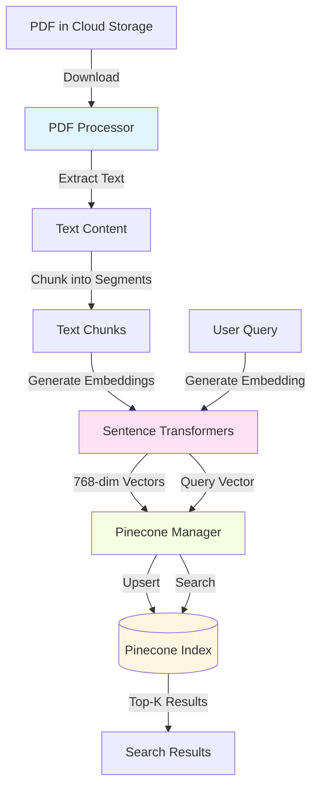
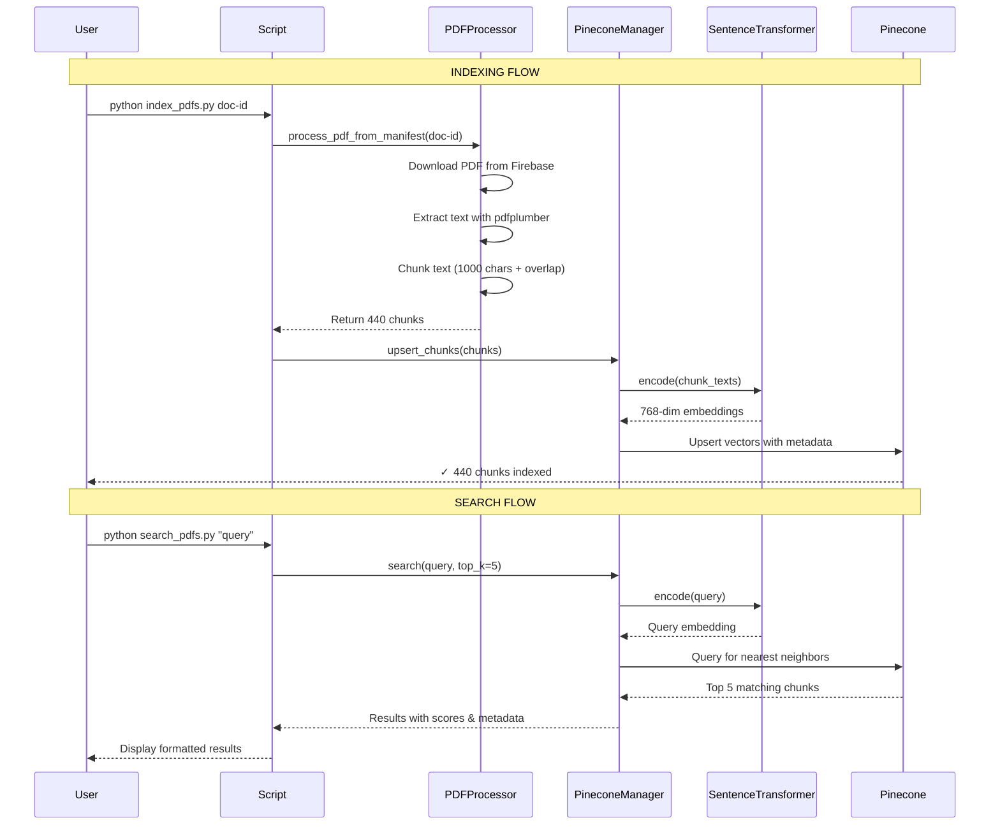

# Code Tour: Pinecone PDF Search System

**Welcome!** This tour will guide you through the Pinecone-powered semantic search system for PDF documents. By the end, you'll understand how PDFs are processed, embedded, indexed, and searched using vector similarity.

## Table of Contents

1. [Overview & Motivation](#overview--motivation)
2. [Key Concepts](#key-concepts)
3. [Architecture](#architecture)
4. [Core Components](#core-components)
5. [Workflow Walkthrough](#workflow-walkthrough)
6. [Code Deep Dive](#code-deep-dive)
7. [Common Operations](#common-operations)
8. [Troubleshooting](#troubleshooting)
9. [External Resources](#external-resources)

---

## Overview & Motivation

### What Problem Does This Solve?

Traditional keyword search (like Ctrl+F) only finds exact text matches. If you search for "literature research" but the document says "bibliographic investigation," you won't find it.

**Semantic search** solves this by understanding *meaning*, not just matching words. It uses AI embeddings to find conceptually similar content, even if the exact words differ.

### What Does This System Do?

1. **Downloads PDFs** from cloud storage (Firebase Storage or Google Drive)
2. **Extracts text** from PDFs using pdfplumber
3. **Chunks text** into ~1000 character segments with overlap
4. **Generates embeddings** (768-dimensional vectors) for each chunk using sentence-transformers
5. **Indexes embeddings** in Pinecone vector database
6. **Enables semantic search** - find relevant content by meaning, not just keywords

### Tech Stack

- **Pinecone**: Serverless vector database for storing and searching embeddings
- **sentence-transformers**: Generate text embeddings (all-mpnet-base-v2 model)
- **pdfplumber**: Extract text from PDFs
- **langchain**: Text chunking with intelligent splitting
- **Python 3.11+**: Core language

---

## Key Concepts

### 1. Text Embeddings

**What are they?**
Embeddings convert text into numerical vectors (arrays of numbers) that capture semantic meaning. Similar text produces similar vectors.

**Example:**
```
"literature research"    → [0.23, -0.45, 0.67, ..., 0.12]  (768 numbers)
"bibliographic study"    → [0.21, -0.43, 0.69, ..., 0.14]  (similar!)
"pizza recipes"          → [-0.67, 0.89, -0.23, ..., 0.45] (different!)
```

**Our Model**: `all-mpnet-base-v2`
- Produces 768-dimensional vectors
- Trained on 1B+ sentence pairs
- Good balance of quality and speed
- [Documentation](https://huggingface.co/sentence-transformers/all-mpnet-base-v2)

### 2. Vector Similarity

Vectors are compared using **cosine similarity**:
- Score of 1.0 = identical meaning
- Score of 0.0 = unrelated
- Score of -1.0 = opposite meaning (rare)

**In practice:**
- 0.7+ = very similar
- 0.5-0.7 = moderately similar
- 0.3-0.5 = somewhat related
- <0.3 = likely unrelated

### 3. Chunking

PDFs are split into ~1000 character chunks with 200 character overlap.

**Why chunk?**
- Embeddings work best on focused text segments
- Enables precise source attribution
- Manages context length limits

**Why overlap?**
- Prevents concepts from being split across chunks
- Ensures continuous context at boundaries

### 4. Pinecone Vector Database

Pinecone is a managed vector database optimized for:
- **Fast similarity search** (finds nearest neighbors in milliseconds)
- **Scalability** (handles millions of vectors)
- **Metadata filtering** (filter by document, learning unit, etc.)
- **Serverless** (no infrastructure management)

[Pinecone Documentation](https://docs.pinecone.io/)

---

## Architecture

### System Diagram



### Data Flow



### Directory Structure

```
pdf-search/
├── config.py                 # Configuration management
├── pdf_processor.py          # PDF download, extraction, chunking
├── pinecone_manager.py       # Embedding generation, Pinecone operations
├── scripts/
│   ├── create_index.py       # Create Pinecone index
│   ├── index_pdfs.py         # Index PDFs from manifest
│   ├── search_pdfs.py        # Search indexed content
│   └── manage_index.py       # Index management utilities
├── materials/
│   └── manifest.json         # PDF metadata and cloud URLs
├── .env                      # Environment variables (not in git)
└── requirements.txt          # Python dependencies
```

---

## Core Components

### 1. Configuration System

**File**: [`config.py`](../config.py)

**Purpose**: Centralized configuration management using environment variables with sensible defaults.

**Key Settings**:
```python
# Pinecone Settings
PINECONE_API_KEY          # Your Pinecone API key (sensitive!)
PINECONE_ENVIRONMENT      # Region: us-east-1
PINECONE_INDEX_NAME       # Default: sociology-pdfs
PINECONE_NAMESPACE        # Default: default

# Embedding Settings
EMBEDDING_MODEL           # Default: all-mpnet-base-v2
EMBEDDING_DIMENSION       # Default: 768

# PDF Processing
CHUNK_SIZE                # Default: 1000 characters
CHUNK_OVERLAP             # Default: 200 characters

# Search Settings
DEFAULT_TOP_K             # Default: 5 results
SIMILARITY_THRESHOLD      # Default: 0.7
```

**Code Reference**: See [`config.py:28-50`](../config.py#L28-L50) for configuration class definition.

**Environment Variables**: Create a `.env` file (see [`.env.example`](../.env.example))

---

### 2. PDF Processor

**File**: [`pdf_processor.py`](../pdf_processor.py)

**Purpose**: Handle all PDF-related operations: downloading, text extraction, and chunking.

#### Key Methods

##### `download_from_url(url)` - [`pdf_processor.py:269`](../pdf_processor.py#L269)
Downloads PDFs from any direct URL (Firebase Storage, etc.)

```python
pdf_content = processor.download_from_url(firebase_url)
# Returns: bytes (PDF binary content)
```

##### `extract_text(pdf_content)` - [`pdf_processor.py:154`](../pdf_processor.py#L154)
Extracts text from PDF using pdfplumber (fallback to PyPDF2)

```python
text = processor.extract_text(pdf_content, method="pdfplumber")
# Returns: str (full extracted text with page markers)
```

**Why pdfplumber?** Better text extraction quality than PyPDF2, especially for complex layouts.

##### `chunk_text(text, document_id, metadata)` - [`pdf_processor.py:180`](../pdf_processor.py#L180)
Splits text into overlapping chunks using langchain's RecursiveCharacterTextSplitter

```python
chunks = processor.chunk_text(
    text="Long document text...",
    document_id="sozialwissenschaftliches-arbeiten",
    metadata={"learning_unit": "LE_I", "title": "..."}
)
# Returns: List[Dict] with 'id', 'text', and 'metadata' for each chunk
```

**Chunk Format**:
```python
{
    'id': 'doc-id#chunk_1',
    'text': 'The full text of this chunk...',
    'metadata': {
        'document_id': 'doc-id',
        'document_title': 'Title',
        'chunk_number': 1,
        'total_chunks': 440,
        'learning_unit': 'LE_I',
        'chunk_text': 'Preview of first 500 chars...',
        # ... more metadata
    }
}
```

##### `process_pdf_from_manifest(material_id)` - [`pdf_processor.py:286`](../pdf_processor.py#L286)
**Main pipeline**: Read manifest → Download → Extract → Chunk

```python
chunks = processor.process_pdf_from_manifest("sozialwissenschaftliches-arbeiten")
# Returns: List of chunks ready for indexing
```

**Manifest Integration**: Reads from [`materials/manifest.json`](../../materials/manifest.json) to get:
- PDF cloud storage URL (Firebase or Google Drive)
- Document metadata (title, course, learning unit, etc.)
- Section information

---

### 3. Pinecone Manager

**File**: [`pinecone_manager.py`](../pinecone_manager.py)

**Purpose**: Manage all Pinecone operations including embedding generation, indexing, and search.

#### Initialization - [`pinecone_manager.py:16`](../pinecone_manager.py#L16)

```python
manager = PineconeManager(
    api_key=None,           # Uses Config.PINECONE_API_KEY if None
    index_name=None,        # Uses Config.PINECONE_INDEX_NAME if None
    namespace=None,         # Uses Config.PINECONE_NAMESPACE if None
    embedding_model=None    # Uses Config.EMBEDDING_MODEL if None
)
```

**What happens on init?**
1. Loads configuration from environment
2. Initializes Pinecone client ([`pinecone_manager.py:41`](../pinecone_manager.py#L41))
3. **Downloads and loads sentence-transformers model** ([`pinecone_manager.py:45-47`](../pinecone_manager.py#L45-L47))
   - First run: Downloads ~420MB model from HuggingFace
   - Subsequent runs: Loads from local cache (~2 seconds)

#### Key Methods

##### `create_index(dimension, metric, region)` - [`pinecone_manager.py:49`](../pinecone_manager.py#L49)
Creates a new Pinecone serverless index

```python
manager.create_index(
    dimension=768,          # Must match embedding model
    metric="cosine",        # Similarity metric
    cloud="aws",
    region="us-east-1"
)
```

**Important**: Dimension must match your embedding model!
- `all-mpnet-base-v2` → 768 dimensions
- `llama-text-embed-v2` → 1024 dimensions (Pinecone's model)

##### `embed_texts(texts, show_progress)` - [`pinecone_manager.py:100`](../pinecone_manager.py#L100)
**Core function**: Converts text to embeddings

```python
embeddings = manager.embed_texts(
    texts=["Text 1", "Text 2", ...],
    show_progress=True
)
# Returns: List[List[float]] - Each text becomes a 768-dim vector
```

**Performance**:
- ~30-50 chunks/second on CPU
- ~200-500 chunks/second on GPU
- For 440 chunks: ~10-15 seconds on CPU

##### `upsert_chunks(chunks, batch_size)` - [`pinecone_manager.py:118`](../pinecone_manager.py#L118)
**Main indexing function**: Embed and upload chunks to Pinecone

```python
result = manager.upsert_chunks(
    chunks=chunks,          # From pdf_processor
    batch_size=100,         # Chunks per API call
    show_progress=True
)
# Returns: {'total': 440, 'upserted': 440, 'failed': 0}
```

**Process** ([`pinecone_manager.py:150-162`](../pinecone_manager.py#L150-L162)):
1. Extract text from all chunks
2. Generate embeddings in batch
3. Prepare vectors with metadata
4. Upsert to Pinecone in batches of 100

**Why batch?**
- API rate limits
- Better error handling
- Progress tracking

##### `search(query, top_k, filter_metadata)` - [`pinecone_manager.py:202`](../pinecone_manager.py#L202)
**Main search function**: Semantic search for relevant chunks

```python
results = manager.search(
    query="How to do literature research?",
    top_k=5,
    filter_metadata={'learning_unit': 'LE_I'},  # Optional filtering
    include_metadata=True
)
```

**Process** ([`pinecone_manager.py:225-236`](../pinecone_manager.py#L225-L236)):
1. Generate embedding for query text
2. Search Pinecone for nearest neighbor vectors
3. Return top-k results with scores and metadata

**Result Format**:
```python
[
    {
        'id': 'doc#chunk_235',
        'score': 0.5956,  # Cosine similarity (0-1)
        'metadata': {
            'document_title': 'Sozialwissenschaftliches Arbeiten',
            'chunk_number': 235,
            'chunk_text': 'Preview...',
            'learning_unit': 'LE_I',
            # ...
        }
    },
    # ... more results
]
```

---

### 4. Command-Line Scripts

#### Create Index - [`scripts/create_index.py`](../scripts/create_index.py)

Creates a new Pinecone index with the configured dimensions.

```bash
python scripts/create_index.py
```

**When to use**: First time setup, or after deleting the index.

**What it does**:
1. Loads configuration
2. Initializes PineconeManager (downloads embedding model)
3. Creates serverless index in us-east-1
4. Waits for index to be ready

#### Index PDFs - [`scripts/index_pdfs.py`](../scripts/index_pdfs.py)

Processes and indexes PDFs from the manifest.

```bash
# Index a single PDF
python scripts/index_pdfs.py sozialwissenschaftliches-arbeiten

# Index all PDFs in manifest
python scripts/index_pdfs.py --all

# Reindex (delete old + upload new)
python scripts/index_pdfs.py sozialwissenschaftliches-arbeiten --reindex
```

**Process** ([`scripts/index_pdfs.py:41-79`](../scripts/index_pdfs.py#L41-L79)):
1. Initialize PDF processor and Pinecone manager
2. Load material from manifest
3. Download and process PDF → chunks
4. Generate embeddings for all chunks
5. Upsert to Pinecone

**Output**:
```
Processing: sozialwissenschaftliches-arbeiten
  Downloading PDF from Firebase Storage...
  Extracting text using pdfplumber...
  Extracted 324589 characters
  Chunking text...
  Created 440 chunks
  Generating embeddings...
  Upserting chunks...
✓ Successfully indexed 440 chunks
```

#### Search PDFs - [`scripts/search_pdfs.py`](../scripts/search_pdfs.py)

Semantic search across indexed content.

```bash
# Basic search
python scripts/search_pdfs.py "Literaturrecherche"

# With custom threshold and top-k
python scripts/search_pdfs.py "qualitative methods" --threshold 0.4 --top-k 10

# Filter by metadata
python scripts/search_pdfs.py "Theorien" --filter learning_unit=LE_I

# JSON output
python scripts/search_pdfs.py "Gütekriterien" --threshold 0.4 --json
```

**Process** ([`scripts/search_pdfs.py:134-142`](../scripts/search_pdfs.py#L134-L142)):
1. Initialize PineconeManager
2. Generate embedding for query
3. Search Pinecone for similar vectors
4. Filter by similarity threshold
5. Format and display results

#### Manage Index - [`scripts/manage_index.py`](../scripts/manage_index.py)

Index management utilities.

```bash
# View index statistics
python scripts/manage_index.py stats

# List all documents
python scripts/manage_index.py list

# Delete a document
python scripts/manage_index.py delete sozialwissenschaftliches-arbeiten

# Reset index (delete all data)
python scripts/manage_index.py reset --confirm
```

---

## Workflow Walkthrough

### Complete Indexing Flow

Let's trace what happens when you run:
```bash
python scripts/index_pdfs.py sozialwissenschaftliches-arbeiten
```

#### Step 1: Initialization

**Script**: [`scripts/index_pdfs.py:19-32`](../scripts/index_pdfs.py#L19-L32)
```python
processor = PDFProcessor()  # Initializes text chunker
manager = PineconeManager() # Downloads embedding model, connects to Pinecone
```

**Console Output**:
```
Loading embedding model: all-mpnet-base-v2...
✓ Embedding model loaded
✓ Managers initialized
```

#### Step 2: Load from Manifest

**Code**: [`pdf_processor.py:301-313`](../pdf_processor.py#L301-L313)

Reads [`materials/manifest.json`](../../materials/manifest.json) to get:
```json
{
  "id": "sozialwissenschaftliches-arbeiten",
  "title": "Sozialwissenschaftliches Arbeiten",
  "url": "https://firebasestorage.googleapis.com/...",
  "learning_unit": "LE_I",
  "pages": 108
}
```

#### Step 3: Download PDF

**Code**: [`pdf_processor.py:269-284`](../pdf_processor.py#L269-L284)

Detects Firebase Storage URL and downloads:
```python
pdf_content = download_from_url(firebase_url)  # Returns bytes
```

**Console Output**:
```
Downloading PDF from Firebase Storage...
```

#### Step 4: Extract Text

**Code**: [`pdf_processor.py:123-152`](../pdf_processor.py#L123-L152)

Uses pdfplumber to extract text from all 108 pages:
```python
with pdfplumber.open(pdf_file) as pdf:
    for page in pdf.pages:
        page_text = page.extract_text()
        text.append(f"--- Page {page_num + 1} ---\n{page_text}")
```

**Console Output**:
```
Extracting text using pdfplumber...
Extracted 324589 characters
```

#### Step 5: Chunk Text

**Code**: [`pdf_processor.py:180-230`](../pdf_processor.py#L180-L230)

Splits 324,589 characters into chunks:
```python
text_splitter = RecursiveCharacterTextSplitter(
    chunk_size=1000,
    chunk_overlap=200,
    separators=["\n\n", "\n", ". ", " ", ""]
)
chunks = text_splitter.split_text(text)  # Creates 440 chunks
```

**Why RecursiveCharacterTextSplitter?**
- Tries to split at natural boundaries (paragraphs, sentences)
- Maintains context better than naive splitting
- Respects chunk size limits

**Console Output**:
```
Chunking text...
Created 440 chunks
```

#### Step 6: Generate Embeddings

**Code**: [`pinecone_manager.py:150-153`](../pinecone_manager.py#L150-L153)

Converts all 440 chunks to vectors:
```python
texts = [chunk['text'] for chunk in chunks]
embeddings = self.embed_texts(texts, show_progress=True)
# embeddings = List[List[float]] with shape (440, 768)
```

**How it works** ([`pinecone_manager.py:111-116`](../pinecone_manager.py#L111-L116)):
```python
embeddings = self.embedding_model.encode(
    texts,
    show_progress_bar=True,
    convert_to_numpy=True
)
```

**Console Output**:
```
Generating embeddings...
Batches: 100%|██████████| 14/14 [00:43<00:00]
```

**Performance**: ~10-15 seconds for 440 chunks on CPU

#### Step 7: Prepare Vectors

**Code**: [`pinecone_manager.py:156-162`](../pinecone_manager.py#L156-L162)

Combines embeddings with metadata:
```python
vectors = []
for chunk, embedding in zip(chunks, embeddings):
    vectors.append({
        'id': chunk['id'],              # e.g., "doc#chunk_1"
        'values': embedding,            # [0.23, -0.45, ..., 0.12]
        'metadata': chunk['metadata']   # Document info, chunk number, etc.
    })
```

#### Step 8: Upsert to Pinecone

**Code**: [`pinecone_manager.py:181-191`](../pinecone_manager.py#L181-L191)

Uploads in batches of 100:
```python
for i in range(0, len(vectors), batch_size):
    batch = vectors[i:i + batch_size]
    index.upsert(vectors=batch, namespace=self.namespace)
```

**Console Output**:
```
Upserting chunks: 100%|██████████| 5/5 [00:12<00:00]

✓ Indexing complete!
  Total chunks: 440
  Upserted: 440
  Failed: 0
```

**Why batching?**
- Pinecone API limits
- Better error recovery
- Progress tracking

---

### Complete Search Flow

Let's trace what happens when you run:
```bash
python scripts/search_pdfs.py "Wie macht man Literaturrecherche?" --threshold 0.4
```

#### Step 1: Parse Arguments

**Code**: [`scripts/search_pdfs.py:97-118`](../scripts/search_pdfs.py#L97-L118)

```python
args = parser.parse_args()
# query = "Wie macht man Literaturrecherche?"
# threshold = 0.4
# top_k = 5 (default)
```

#### Step 2: Initialize Manager

**Code**: [`scripts/search_pdfs.py:121-127`](../scripts/search_pdfs.py#L121-L127)

```python
manager = PineconeManager()  # Loads embedding model
```

**Console Output**:
```
Loading embedding model: all-mpnet-base-v2...
✓ Embedding model loaded
✓ Connected to Pinecone
```

#### Step 3: Generate Query Embedding

**Code**: [`pinecone_manager.py:226`](../pinecone_manager.py#L226)

Converts query text to vector:
```python
query_embedding = self.embed_texts([query])[0]
# "Wie macht man Literaturrecherche?" → [0.21, -0.43, 0.69, ..., 0.14]
```

**Why embed the query?**
To compare apples-to-apples:
- Indexed chunks: 768-dim vectors
- Query: Must also be 768-dim vector
- Comparison: Cosine similarity between vectors

#### Step 4: Search Pinecone

**Code**: [`pinecone_manager.py:229-235`](../pinecone_manager.py#L229-L235)

Finds nearest neighbors:
```python
results = index.query(
    vector=query_embedding,      # [0.21, -0.43, ...]
    top_k=5,                     # Return top 5 matches
    filter=None,                 # No metadata filtering
    include_metadata=True,       # Include chunk metadata
    namespace="default"
)
```

**How Pinecone searches**:
1. Compares query vector to ALL indexed vectors (440 chunks)
2. Calculates cosine similarity for each
3. Returns top 5 most similar
4. Takes ~10-50ms (even with millions of vectors!)

**Raw Results**:
```python
{
    'matches': [
        {
            'id': 'sozialwissenschaftliches-arbeiten#chunk_10',
            'score': 0.595889,
            'metadata': {'document_title': '...', 'chunk_text': '...'}
        },
        # ... 4 more results
    ]
}
```

#### Step 5: Filter by Threshold

**Code**: [`scripts/search_pdfs.py:142`](../scripts/search_pdfs.py#L142)

```python
results = [r for r in results if r['score'] >= 0.4]
```

**Why threshold?**
- Filters out low-quality matches
- Default 0.7 is strict (may miss relevant results)
- 0.4-0.5 is more permissive (recommended for German text)

#### Step 6: Format Results

**Code**: [`scripts/search_pdfs.py:23-62`](../scripts/search_pdfs.py#L23-L62)

```python
for i, result in enumerate(results, 1):
    print(format_result(result, i))
```

**Console Output**:
```
✓ Found 5 result(s)

============================================================
Result #1 (Score: 0.5959)
============================================================

Document: Sozialwissenschaftliches Arbeiten
ID: sozialwissenschaftliches-arbeiten#chunk_10
Type: textbook
Learning Unit: LE_I
Chunk: 10/440

Text Preview:
3.1.1 Klassisch: Monografien, Artikel in Fachzeitschriften...

Source: https://firebasestorage.googleapis.com/...
```

---

## Code Deep Dive

### How Embeddings Capture Meaning

Let's understand how the `all-mpnet-base-v2` model works:

**Training Process** (not in our code, but useful to know):
1. Model trained on 1 billion sentence pairs
2. Learns to predict if sentences are similar or different
3. Encodes semantic relationships in 768-dimensional space

**At Runtime** ([`pinecone_manager.py:111-116`](../pinecone_manager.py#L111-L116)):
```python
embeddings = self.embedding_model.encode(
    texts,
    show_progress_bar=show_progress,
    convert_to_numpy=True
)
```

**What happens inside**:
1. Tokenization: "Literaturrecherche" → [101, 15234, 43829, 102] (token IDs)
2. Transformer layers: Process tokens through 12 attention layers
3. Pooling: Combine token embeddings → single 768-dim vector
4. Normalization: Scale vector to unit length

**Result**:
```python
[0.0234, -0.0156, 0.0423, ..., 0.0198]  # 768 numbers
```

### Metadata Filtering Deep Dive

Pinecone supports filtering by metadata during search.

**How to add metadata** ([`pdf_processor.py:211-222`](../pdf_processor.py#L211-L222)):
```python
chunk_metadata = {
    'document_id': document_id,
    'chunk_number': i + 1,
    'learning_unit': 'LE_I',           # Custom metadata
    'material_type': 'textbook',       # Custom metadata
    'document_title': 'Title',         # Custom metadata
    # ... any other metadata
}
```

**How to filter in search**:
```python
results = manager.search(
    query="Theorien",
    filter_metadata={'learning_unit': 'LE_I'}  # Only search LE_I materials
)
```

**Supported operators**:
```python
# Exact match
{'learning_unit': 'LE_I'}

# Multiple conditions (AND)
{'learning_unit': 'LE_I', 'material_type': 'textbook'}

# Range queries
{'chunk_number': {'$gte': 100, '$lte': 200}}
```

[Pinecone Metadata Filtering Docs](https://docs.pinecone.io/docs/metadata-filtering)

### Error Handling Strategy

**Download Errors** ([`pdf_processor.py:279-284`](../pdf_processor.py#L279-L284)):
```python
try:
    response = requests.get(url, timeout=60)
    response.raise_for_status()
    return response.content
except requests.RequestException as e:
    raise Exception(f"Failed to download PDF from {url}: {e}")
```

**Upsert Errors** ([`pinecone_manager.py:181-191`](../pinecone_manager.py#L181-L191)):
```python
for i in iterator:
    batch = vectors[i:i + batch_size]
    try:
        index.upsert(vectors=batch, namespace=self.namespace)
        total_upserted += len(batch)
    except Exception as e:
        print(f"Error upserting batch {i//batch_size}: {e}")
        failed += len(batch)
        # Continue with next batch instead of failing completely
```

**Why continue on error?**
- One bad chunk shouldn't fail entire document
- Allows partial indexing
- Logs failures for debugging

---

## Common Operations

### 1. Index a New PDF

**Add to manifest** ([`materials/manifest.json`](../../materials/manifest.json)):
```json
{
  "id": "new-document",
  "title": "Document Title",
  "url": "https://firebasestorage.googleapis.com/...",
  "learning_unit": "LE_II",
  "pages": 50,
  "type": "textbook"
}
```

**Index it**:
```bash
python scripts/index_pdfs.py new-document
```

### 2. Update an Existing Document

**Reindex** (deletes old, uploads new):
```bash
python scripts/index_pdfs.py sozialwissenschaftliches-arbeiten --reindex
```

**Or manually**:
```bash
# Delete old chunks
python scripts/manage_index.py delete sozialwissenschaftliches-arbeiten

# Index new version
python scripts/index_pdfs.py sozialwissenschaftliches-arbeiten
```

### 3. Search with Multiple Filters

```bash
python scripts/search_pdfs.py "Forschungsmethoden" \
  --filter learning_unit=LE_I \
  --filter material_type=textbook \
  --threshold 0.4 \
  --top-k 10
```

### 4. Check Index Status

```bash
python scripts/manage_index.py stats
```

Output:
```
Index: sociology-pdfs
Total vectors: 440
Dimension: 768
Namespaces:
  - default: 440 vectors
```

### 5. Adjust Similarity Threshold

If getting too few results:
```bash
python scripts/search_pdfs.py "query" --threshold 0.3  # More permissive
```

If getting too many irrelevant results:
```bash
python scripts/search_pdfs.py "query" --threshold 0.6  # More strict
```

**Recommended thresholds**:
- German text: 0.4-0.5
- English text: 0.5-0.6
- Very strict: 0.7+

---

## Troubleshooting

### Issue: "No results found"

**Symptoms**:
```
✗ No results found
Try:
  - Lowering the threshold (--threshold 0.4)
```

**Diagnosis**:
```bash
# Check with JSON output to see actual scores
python scripts/search_pdfs.py "query" --threshold 0.3 --json
```

**Solutions**:
1. Lower threshold: `--threshold 0.4`
2. Try different phrasing
3. Check if document is indexed: `python scripts/manage_index.py stats`

---

### Issue: "Vector dimension 0 does not match"

**Symptoms**:
```
Error: Vector dimension 0 does not match the dimension of the index 768
```

**Cause**: Embeddings not being generated (empty vectors)

**Solution**: Ensure `embed_texts()` is called in `upsert_chunks()`:
- Check [`pinecone_manager.py:151-153`](../pinecone_manager.py#L151-L153)

---

### Issue: "Index already exists"

**Symptoms**:
```
Index 'sociology-pdfs' already exists
```

**Solutions**:
```bash
# Option 1: Use existing index
# (No action needed)

# Option 2: Delete and recreate
python scripts/manage_index.py reset --confirm
python scripts/create_index.py
```

---

### Issue: "Failed to download PDF"

**Symptoms**:
```
Failed to download PDF from Firebase Storage
```

**Diagnosis**:
1. Check URL in manifest.json
2. Verify Firebase Storage permissions
3. Test URL in browser

**Solution**: Update URL in manifest with valid, publicly accessible link

---

### Issue: Slow embedding generation

**Symptoms**: Taking >1 minute for 440 chunks

**Solutions**:
1. **Use GPU**: Install PyTorch with CUDA support
   ```bash
   pip install torch --index-url https://download.pytorch.org/whl/cu118
   ```

2. **Reduce batch size**: Lower memory usage
   ```python
   # In pinecone_manager.py:111
   embeddings = self.embedding_model.encode(
       texts,
       batch_size=32  # Default is 32, try 16 if memory issues
   )
   ```

3. **Use smaller model**: Trade quality for speed
   ```bash
   # In .env
   EMBEDDING_MODEL=all-MiniLM-L6-v2
   EMBEDDING_DIMENSION=384
   ```

---

### Issue: "ModuleNotFoundError"

**Symptoms**:
```
ModuleNotFoundError: No module named 'sentence_transformers'
```

**Solution**:
```bash
# Activate venv
source venv/bin/activate

# Install dependencies
pip install -r requirements.txt
```

---

## External Resources

### Documentation

- **Pinecone**
  - [Official Documentation](https://docs.pinecone.io/)
  - [Python SDK Reference](https://docs.pinecone.io/reference/python-sdk)
  - [Serverless Indexes](https://docs.pinecone.io/docs/serverless)
  - [Metadata Filtering](https://docs.pinecone.io/docs/metadata-filtering)

- **Sentence Transformers**
  - [Documentation](https://www.sbert.net/)
  - [all-mpnet-base-v2 Model Card](https://huggingface.co/sentence-transformers/all-mpnet-base-v2)
  - [Model Comparison](https://www.sbert.net/docs/pretrained_models.html)

- **LangChain**
  - [Text Splitters](https://python.langchain.com/docs/modules/data_connection/document_transformers/)
  - [RecursiveCharacterTextSplitter](https://python.langchain.com/docs/modules/data_connection/document_transformers/text_splitters/recursive_text_splitter)

- **pdfplumber**
  - [GitHub Repository](https://github.com/jsvine/pdfplumber)
  - [Documentation](https://github.com/jsvine/pdfplumber#readme)

### Tutorials

- [Building a Semantic Search Engine with Pinecone](https://docs.pinecone.io/docs/semantic-search)
- [Understanding Text Embeddings](https://www.pinecone.io/learn/vector-embeddings/)
- [Chunking Strategies for RAG](https://www.pinecone.io/learn/chunking-strategies/)

### Research Papers

- **BERT & Transformers**:
  - [BERT: Pre-training of Deep Bidirectional Transformers](https://arxiv.org/abs/1810.04805)
  - [Sentence-BERT: Sentence Embeddings using Siamese BERT-Networks](https://arxiv.org/abs/1908.10084)

- **Vector Search**:
  - [Approximate Nearest Neighbor Search](https://arxiv.org/abs/1603.09320)

---

## Next Steps

Now that you understand the system, here are some ways to extend it:

### 1. Add More Documents
- Update [`materials/manifest.json`](../../materials/manifest.json)
- Run `python scripts/index_pdfs.py --all`

### 2. Improve Search Quality
- Experiment with different embedding models
- Adjust chunk size and overlap
- Implement query expansion (synonyms, translations)

### 3. Add New Features
- **Hybrid Search**: Combine keyword + semantic search
- **Multi-query**: Search multiple queries and merge results
- **Re-ranking**: Use cross-encoder for better ranking
- **Clustering**: Group similar chunks together

### 4. Build Applications
- **Chat Interface**: Answer questions using search results
- **Study Assistant**: Find relevant materials for questions
- **Citation Helper**: Auto-suggest sources for essays

### 5. Monitor & Optimize
- Track search quality metrics
- Monitor Pinecone costs
- Optimize chunk sizes for your content

---

## Questions?

- **Code Issues**: Check troubleshooting section above
- **Concept Questions**: Review key concepts and external resources
- **Feature Requests**: Consider contributing or opening an issue

**Happy searching!** 🔍
